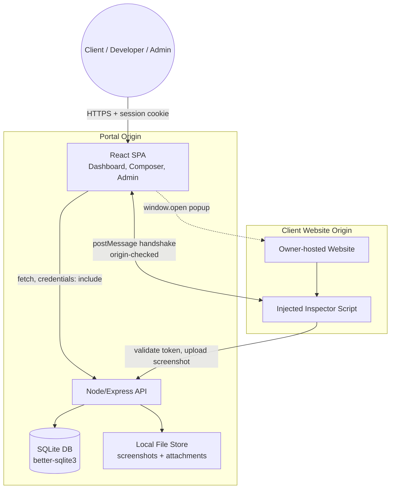
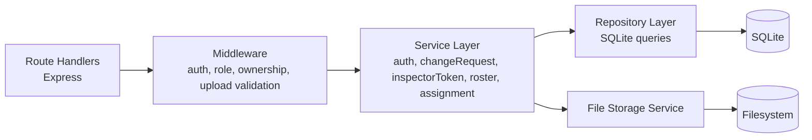
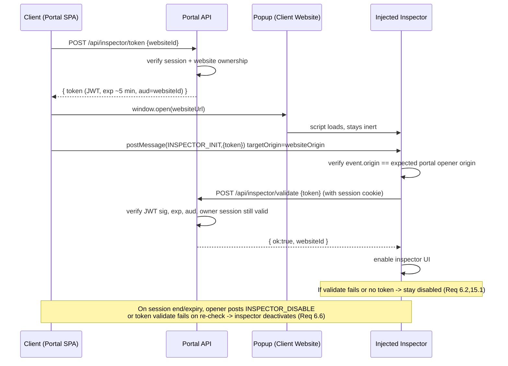
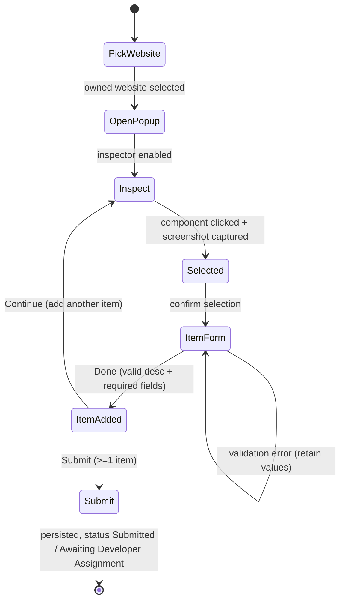
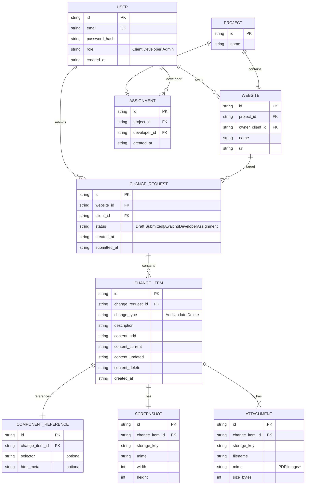

# Design Document

## Overview

The Change Request Portal is a low-traffic, single-tenant personal web application that lets Clients submit visual change requests against websites the portal owner builds and hosts. A Client logs in, sees a role-appropriate dashboard, opens one of their owned websites in a popup, activates a gated inspector to pick an on-page component, captures a highlighted screenshot in the browser, composes one or more change items (Add / Update / Delete) with optional attachments, and submits a report that is routed by role to the Client, the assigned Developer, and the Admin.

This design commits to a deliberately lightweight stack appropriate for a personal project deployed on a single VPS with at most one concurrent user:

- **Frontend:** React (Vite) single-page app with React Router. TypeScript throughout.
- **Backend:** Node.js + TypeScript HTTP API using Express. Serves the SPA build and the REST API.
- **Data layer:** SQLite (embedded, file-based) accessed via `better-sqlite3`. No external database server.
- **File storage:** Local filesystem for screenshots and attachments, referenced by path/id in SQLite.
- **Auth:** Cookie-based session for the portal (HTTP-only, Secure, SameSite). A separate short-lived signed JWT is minted for the inspector handshake.
- **Screenshot capture:** Client-side in the opened website popup using a DOM-to-canvas library (`html2canvas` or `snapdom`), with a highlight overlay drawn over the selected component.

Non-goals for v1 (recorded as future work): embedded-frame website view (popup-only in v1), email/push notifications (dashboard visibility only), and multi-tenant/horizontal scaling concerns.

### Key Design Decisions and Rationale

| Decision | Rationale |
|---|---|
| SQLite + `better-sqlite3` | Zero-infra, file-based, synchronous API ideal for single-user low traffic. Transactions give us the atomic submit required by Req 11.1/11.7. |
| Local filesystem for blobs | No S3/object store needed. Screenshots/attachments are written to a content-addressed directory tree and referenced by row. |
| Popup-only Website_Open_View | Client websites are same-owner but separate origins; a popup avoids `X-Frame-Options`/CSP iframe issues and enables reliable `postMessage` + `window.opener` handshake. Embedded frame deferred. |
| Client-side capture | Avoids running a headless browser server-side; the inspector already lives in the page and can capture exactly what the Client sees, with the highlight overlay. |
| Short-lived signed inspector token (JWT) + postMessage handshake | The inspector must never be usable by anonymous/public visitors. Gating combines an owner session cookie, an explicitly minted per-open token, and an origin-checked `postMessage` handshake with the portal window. |
| Cookie session for portal, JWT only for inspector | The portal SPA and API share an origin, so an HTTP-only session cookie is simplest and safest. The injected inspector runs on a different origin (the client website) and cannot read the portal cookie, so it needs a bearer token passed via `postMessage`. |

## Architecture

### System Context

### Layered Backend Architecture

- **Route handlers**: thin; parse/validate request shape, delegate to services.
- **Middleware**: `requireSession`, `requireRole(role)`, `requireWebsiteOwnership`, `validateUpload` (type + size), `csrf`.
- **Service layer**: business logic and transactions. `changeRequestService.submit()` runs inside a single SQLite transaction so partial persistence never survives (Req 11.7).
- **Repository layer**: parameterized SQL only (no string interpolation) to prevent injection.
- **File storage service**: writes/reads blobs under a configured root, validates MIME/extension and size, returns opaque storage keys.

### Deployment View

Single Node process on a VPS behind a TLS-terminating reverse proxy (e.g., Caddy or nginx). All portal traffic is HTTPS (Req 15.5). SQLite file and the blob directory live on the VPS disk (backed up by filesystem snapshot/cron).

## Components and Interfaces

### Frontend Components

- **AuthGate / Router guard**: redirects unauthenticated users to `/login` (Req 1.3, 2.5). Reads session state from `/api/session`.
- **LoginView**: credential form; shows auth errors (Req 1.1, 1.2).
- **DashboardRouter**: renders `ClientDashboard`, `DeveloperDashboard`, or `AdminDashboard` based on role (Req 2.2).
- **ClientDashboard**: lists the Client's Change_Requests with status, empty-state + New control (Req 3.1–3.5).
- **ChangeRequestDetail**: shows Change_Items, Component_References, Screenshots, Attachments (Req 3.3, 12.3).
- **WebsitePicker**: lists only owned Websites; selecting one starts composition (Req 4.1, 4.4).
- **WebsiteOpenController**: opens the popup via `window.open`, tracks it, performs the postMessage handshake, minting the inspector token first (Req 5.1–5.4, 6.1).
- **ChangeComposer**: manages the in-progress Change_Request; per-item form driven by Change_Type (Req 8, 10). Disables Submit while zero items (Req 10.4).
- **AttachmentInput**: shown only for Add/Update; client-side type/size pre-check (Req 9).
- **DeveloperDashboard**: assigned Projects' Change_Requests (Req 12).
- **AdminDashboard**: roster management + assignment management + all Change_Requests (Req 13, 14, 11.4/11.6).

### Injected Inspector (runs on client website origin)

- **Bootstrap**: on load, does nothing visible until it receives an origin-verified `INSPECTOR_INIT` message from `window.opener` carrying the inspector token.
- **TokenValidator**: calls the portal API `POST /api/inspector/validate` with the token; only on success does it enable UI (Req 6.1, 6.2, 6.5, 15.1, 15.2).
- **ComponentPicker**: hover-highlights DOM elements, click selects; computes optional selector metadata (Req 6.3, 6.4).
- **Capturer**: renders the page to canvas, overlays the highlight region, produces a PNG blob (Req 7.1, 7.2); on failure emits a retryable error (Req 7.4).
- **Uploader**: sends screenshot + component reference to portal via `postMessage` back to opener (which uploads with the session cookie), or directly with the bearer token. Design uses postMessage-to-opener so uploads carry the portal session.

### Backend API Surface

All endpoints require an authenticated session unless noted. All responses over HTTPS. Errors use a consistent shape `{ error: { code, message, field? } }`.

| Method | Path | Purpose | Requirements |
|---|---|---|---|
| POST | `/api/auth/login` | Establish session | 1.1, 1.2, 15.5 |
| POST | `/api/auth/logout` | Terminate session | 1.4 |
| GET | `/api/session` | Current user + role, or 401 | 1.3, 2.2, 2.5 |
| GET | `/api/websites` | Websites owned by current Client | 4.1 |
| POST | `/api/inspector/token` | Mint short-lived inspector JWT for an owned website | 5.1, 6.1, 6.5, 15.2 |
| POST | `/api/inspector/validate` | Validate inspector token (called by injected script) | 6.2, 15.1, 15.2 |
| POST | `/api/change-requests` | Create draft Change_Request bound to a website | 4.2, 4.3, 10.3, 15.4 |
| POST | `/api/change-requests/:id/items` | Add a Change_Item | 8, 9, 10.1, 10.2 |
| POST | `/api/change-requests/:id/screenshots` | Upload captured screenshot | 7.3, 6.3 |
| POST | `/api/change-requests/:id/items/:itemId/attachments` | Upload attachment | 9.1–9.4 |
| POST | `/api/change-requests/:id/submit` | Submit & route | 11.1–11.7, 14.4 |
| GET | `/api/change-requests` | Role-scoped list | 3.1, 3.2, 12.1, 12.2, 11.2–11.4 |
| GET | `/api/change-requests/:id` | Detail (ownership/assignment checked) | 3.3, 12.3 |
| GET | `/api/admin/developers` | List roster | 13.3 |
| POST | `/api/admin/developers` | Add developer | 13.1, 13.4 |
| DELETE | `/api/admin/developers/:id` | Remove developer + assignments | 13.2 |
| GET | `/api/admin/assignments` | List assignments | 14 |
| PUT | `/api/admin/projects/:projectId/assignment` | Set/replace assignment | 14.1, 14.3, 14.5 |
| DELETE | `/api/admin/projects/:projectId/assignment` | Remove assignment | 14.2 |

### Authentication, Session, and Authorization

- **Portal session**: On successful login, the server creates a session row (or signed session cookie) and sets an HTTP-only, `Secure`, `SameSite=Strict` cookie. Idle timeout of 30 minutes is enforced by tracking `last_active_at` and rejecting/renewing on each request (Req 1.5). Logout deletes the session (Req 1.4).
- **Role model**: Each User row has exactly one role in {Client, Developer, Admin} (Req 2.1). `requireRole` middleware enforces per-route access; admin-only routes require Admin (Req 2.3, 2.4).
- **Ownership checks**: `requireWebsiteOwnership` verifies the website's `owner_client_id` equals the session user for any create/open/submit action (Req 4.2, 15.4). Developer detail access is checked against active Assignment (Req 12.2).
- **Unauthenticated protected access**: any protected route without a valid session returns 401 (Req 2.5, 15.3).

### Inspector Injection, Token, and postMessage Handshake

The inspector script is injected into every owner-hosted website (e.g., via a `<script src="https://portal/inspector.js">` tag the owner includes). It stays inert for anonymous visitors and only activates through this flow:

Security notes:
- The inspector requires **all** of: a valid opener relationship, an origin-checked message, and a backend-validated token tied to an active owner session for that specific website. Anonymous visitors have none of these, so activation is denied (Req 6.2, 15.1).
- Tokens are short-lived (~5 min) and single-website scoped (`aud=websiteId`). Expiry or session end deactivates the inspector (Req 6.5, 6.6).
- Recording a Component_Reference or capturing a Screenshot is gated on a successful validate (Req 15.2).

### Popup Window Management

- `WebsiteOpenController` calls `window.open(url, name, features)` with resizable features and retains the handle (Req 5.1, 5.2).
- The controller polls `popup.closed` and listens for `INSPECTOR_*` messages; navigation within the site is allowed (Req 5.3).
- The active composition is bound to the selected website id in app state and on the draft Change_Request (Req 5.4, 10.3).
- On logout/idle-expiry the controller posts `INSPECTOR_DISABLE` and/or the next validate fails (Req 6.6).

### Client-Side Screenshot Capture with Highlight

- On component click, the inspector records the element bounding box, draws a highlight overlay element, then calls the capture library to rasterize the document (including the overlay) to a canvas → PNG blob (Req 7.1, 7.2).
- Capture runs in parallel with recording the Component_Reference (Req 7.1).
- The blob is handed to the opener/portal and uploaded to `/api/change-requests/:id/screenshots` and attached to the current Change_Item (Req 7.3).
- If capture throws, the inspector surfaces a retryable error and keeps the selection active (Req 7.4).

### Change Composition Flow

- Change_Type drives the form: Add → single content field; Delete → single content field, no attachments; Update → current-value + updated-value fields (Req 8.2–8.4, 8.8, 9.5).
- Description 1–2000 chars, required (Req 8.1, 8.5); required content fields validated (Req 8.6).
- Attachments allowed only for Add/Update, PDF/image only, ≤10 MB (Req 9).
- Submit disabled while zero items (Req 10.4); submit rejects zero items and caps at 500 items (Req 11.1, 11.5).

### Submission and Role-Based Routing

On submit, within a single SQLite transaction: validate item count (1–500), set status, record timestamp, and determine routing based on whether the website's Project has an active Assignment:
- Assignment exists → status `Submitted`, visible to Client, assigned Developer, Admin (Req 11.2–11.4, 14.4).
- No assignment → status `Awaiting Developer Assignment`, visible to Client and Admin (Req 11.6).
- Any failure rolls back the transaction, leaving status unchanged (Req 11.7).

### Admin Roster and Assignment Management

- Roster: add (reject duplicate identifier), remove (cascade active assignments), list (Req 13).
- Assignment: a Project has at most one active Assignment; setting replaces the prior one; assigning a non-roster developer is rejected (Req 14.1–14.5). Cascade on developer removal (Req 13.2).

## Data Models

SQLite schema. All ids are UUID strings. Timestamps stored as ISO-8601 text. Foreign keys enforced (`PRAGMA foreign_keys = ON`).

Model notes:
- **User** holds exactly one role (Req 2.1). Password stored as a strong hash (bcrypt/argon2), never plaintext.
- **Website.owner_client_id** enforces ownership queries (Req 4.1, 15.4). Each Website has exactly one `project_id` (Req 14, "belongs to exactly one project").
- **Assignment** is unique per `project_id` (at most one active assignment); replacing updates/replaces the row (Req 14.3). Deleting a developer cascades assignment removal (Req 13.2).
- **Change_Item** stores type-specific content columns; only the columns relevant to `change_type` are populated. Description and required content are non-empty/non-whitespace at save (Req 8.5, 8.6).
- **Component_Reference** requires an associated Screenshot; selector/html_meta are optional (Req 6.3, 6.4).
- **Screenshot** and **Attachment** reference blobs by `storage_key`; the file store holds the bytes. Attachment `mime` restricted to PDF/image, `size_bytes` ≤ 10 MB (Req 9.2–9.4).

## Correctness Properties

*A property is a characteristic or behavior that should hold true across all valid executions of a system-essentially, a formal statement about what the system should do. Properties serve as the bridge between human-readable specifications and machine-verifiable correctness guarantees.*

The following properties were derived from the acceptance criteria via the prework analysis and consolidated to remove redundancy. Each is universally quantified and intended to be implemented as a single property-based test (minimum 100 iterations). Pure logic (validation, filtering, routing, assignment semantics, token validity) is tested directly; I/O boundaries (filesystem, HTTPS transport) are covered by unit/integration/smoke tests in the Testing Strategy.

### Property 1: Unauthenticated access to protected resources is denied

*For any* protected resource or action, when the request carries no valid authenticated session, the Portal denies it and returns an authentication error (401 / redirect to login).

**Validates: Requirements 1.3, 2.5, 15.3**

### Property 2: Only exact credentials authenticate

*For any* pair (identifier, password) that does not exactly match a stored user's credentials, login is rejected with an authentication error; only the exact valid pair establishes a session.

**Validates: Requirements 1.2**

### Property 3: Idle timeout invalidates sessions

*For any* session and any idle duration since last activity, the session is valid if and only if that idle duration is at most 30 minutes.

**Validates: Requirements 1.5**

### Property 4: Dashboard view matches role

*For any* authenticated user with role R in {Client, Developer, Admin}, the resolved dashboard/session view corresponds exactly to role R.

**Validates: Requirements 2.2**

### Property 5: Role permission matrix is enforced

*For any* user and any action, the action is permitted if and only if the action belongs to the allowed set for that user's role; admin-only actions (roster and assignment management) are permitted if and only if the role is Admin. Otherwise the Portal returns an authorization error.

**Validates: Requirements 2.3, 2.4**

### Property 6: Client change-request list is exactly the client's own

*For any* collection of Change_Requests across clients, the list returned for client C equals exactly the set of Change_Requests whose client_id is C (no more, no fewer).

**Validates: Requirements 3.1, 3.2**

### Property 7: Change-request detail contains exactly its own items

*For any* Change_Request, its detail view returns exactly the Change_Items whose change_request_id is that Change_Request.

**Validates: Requirements 3.3**

### Property 8: Website picker lists exactly the client's owned websites

*For any* collection of Websites across owners, the picker list for client C equals exactly the set of Websites whose owner_client_id is C.

**Validates: Requirements 4.1**

### Property 9: Ownership is enforced for open/create/submit

*For any* client and any Website whose owner_client_id is not that client, requests to open, create a Change_Request for, or submit a Change_Request against that Website are denied with an authorization error.

**Validates: Requirements 4.2, 15.4**

### Property 10: One website per change request

*For any* Change_Request and any set of Change_Items added to it, all items are associated with the single Website recorded on the Change_Request; the Change_Request references exactly one Website.

**Validates: Requirements 4.4, 5.4, 10.3**

### Property 11: Inspector activation is fully gated

*For any* inspector activation attempt, activation (and any subsequent recording of a Component_Reference or Screenshot capture) succeeds if and only if the presented token is validly signed, unexpired, scoped to the opened Website, and backed by an active Owner_Session of the client who owns that Website; in all other cases (no token, expired token, wrong website, ended/absent owner session, anonymous visitor) activation is denied and the Website_Open_View is left unchanged.

**Validates: Requirements 6.1, 6.2, 6.5, 6.6, 15.1, 15.2**

### Property 12: Component selection yields a linked reference and highlighted screenshot

*For any* component selection during composition, the resulting Change_Item retains an associated Component_Reference and a Screenshot that includes a highlighted region for the selected component; when selector/HTML metadata is available it is stored as optional data on the Component_Reference, and when absent the reference is still valid.

**Validates: Requirements 6.3, 6.4, 7.1, 7.2, 7.3, 8.9**

### Property 13: Description validation

*For any* description string, saving a Change_Item is accepted if and only if the description, after trimming, is non-empty and at most 2000 characters; empty or whitespace-only descriptions are rejected with a description-identifying validation error while entered values are retained.

**Validates: Requirements 8.1, 8.5**

### Property 14: Type-specific required content validation

*For any* Change_Type and its required content field(s) — Add requires the add-content field, Delete requires the delete-content field, Update requires both current-value and updated-value fields, each 1 to 2000 characters — saving is accepted if and only if every required field for that type is non-empty (non-whitespace) and within bounds; otherwise the save is rejected identifying the missing field and retaining entered values.

**Validates: Requirements 8.2, 8.3, 8.4, 8.6**

### Property 15: Attachment availability by change type

*For any* Change_Type, the attachment control is available (attachments permitted) if and only if the type is Add or Update; for Delete no attachment is accepted.

**Validates: Requirements 8.7, 8.8, 9.1, 9.5**

### Property 16: Attachment file validation

*For any* candidate attachment file, it is accepted if and only if its type is PDF or an image type and its size is at most 10 megabytes; unsupported types are rejected with a type-identifying error and oversized files with a size-limit error.

**Validates: Requirements 9.2, 9.3, 9.4**

### Property 17: Item accumulation within a change request

*For any* sequence of valid Change_Items added to a draft Change_Request, the Change_Request contains exactly those items, in order of addition.

**Validates: Requirements 10.1, 10.2**

### Property 18: Submission guard on item count

*For any* Change_Request, submission is rejected (leaving status and stored items unchanged) if it contains zero Change_Items or more than 500 Change_Items; submission proceeds only for counts in the range 1 to 500.

**Validates: Requirements 10.4, 11.1, 11.5**

### Property 19: Submission routing and visibility

*For any* Change_Request submitted with 1 to 500 items: if the associated Website's Project has an active Assignment, the status becomes Submitted and the request is visible to the submitting Client, the assigned Developer, and the Admin; if the Project has no active Assignment, the status becomes Awaiting Developer Assignment and the request is visible to the submitting Client and the Admin. A submitted_at timestamp is recorded in all successful cases.

**Validates: Requirements 11.1, 11.2, 11.3, 11.4, 11.6, 14.4**

### Property 20: Submission atomicity

*For any* submission that fails during persistence, the resulting stored state equals the pre-submission state (status unchanged, no partial items persisted).

**Validates: Requirements 11.7**

### Property 21: Developer change-request list is exactly assigned projects'

*For any* collection of Change_Requests and Assignments, the list returned for developer D equals exactly the set of Change_Requests whose Website's Project has an active Assignment to D.

**Validates: Requirements 12.1, 12.2**

### Property 22: Developer detail contains full item payload

*For any* Change_Request a developer is permitted to view, the detail includes all its Change_Items together with their Component_References, Screenshots, and Attachments.

**Validates: Requirements 12.3**

### Property 23: Roster add then list round-trip

*For any* new developer with a unique identifier, after adding to the roster the roster listing contains exactly that developer among its members.

**Validates: Requirements 13.1, 13.3**

### Property 24: Developer removal cascades assignments

*For any* developer holding any set of assignments, after removal the roster excludes that developer and no Assignment references them.

**Validates: Requirements 13.2**

### Property 25: Duplicate roster identifier is rejected

*For any* identifier already present in the roster, adding a developer with that identifier is rejected with a duplicate-identifying error and the roster is unchanged.

**Validates: Requirements 13.4**

### Property 26: Assignment semantics (at most one active per project)

*For any* Project and any sequence of set/remove assignment operations, at most one Assignment is active for that Project, and it names the developer from the most recent successful set (or none if the last operation was a removal).

**Validates: Requirements 14.1, 14.2, 14.3**

### Property 27: Non-roster developer cannot be assigned

*For any* developer identifier not present in the roster, creating an Assignment with that identifier is rejected with a validation error and no Assignment is created.

**Validates: Requirements 14.5**

## Error Handling

All errors return a consistent JSON shape: `{ error: { code, message, field? } }`, with appropriate HTTP status codes.

| Scenario | Handling | Requirements |
|---|---|---|
| Invalid credentials | 401 `AUTH_INVALID_CREDENTIALS`, generic message (no user enumeration) | 1.2 |
| No/expired session on protected route | 401 `AUTH_REQUIRED`; SPA redirects to login | 1.3, 1.5, 2.5, 15.3 |
| Idle >30 min | Session invalidated server-side; next request treated as unauthenticated | 1.5 |
| Action not permitted for role | 403 `AUTHZ_FORBIDDEN` | 2.3, 2.4 |
| Website not owned by client | 403 `AUTHZ_NOT_OWNER` | 4.2, 15.4 |
| Inspector activation without valid token/session | Inspector stays disabled; portal shows "activation denied: no authenticated owning-client session"; `/api/inspector/validate` returns 403 `INSPECTOR_DENIED`; popup view unchanged | 6.2, 15.1, 15.2 |
| Inspector token expired / owner session ended | Next validate returns 403; inspector deactivates | 6.6 |
| Screenshot capture failure | Inspector surfaces retryable error; selection retained; no item persisted | 7.4 |
| Empty/whitespace description | 400 `VALIDATION_DESCRIPTION_REQUIRED`, `field: description`; entered values retained client-side | 8.5 |
| Missing required content field | 400 `VALIDATION_CONTENT_REQUIRED`, `field: <name>`; values retained | 8.6 |
| Unsupported attachment type | 400 `VALIDATION_UNSUPPORTED_TYPE`, `field: attachment` | 9.3 |
| Attachment > 10 MB | 400 `VALIDATION_FILE_TOO_LARGE`, `field: attachment` | 9.4 |
| Submit with 0 items | 400 `VALIDATION_NO_ITEMS`; status unchanged | 11.5 |
| Submit with > 500 items | 400 `VALIDATION_TOO_MANY_ITEMS`; status unchanged | 11.1 |
| Persistence failure on submit | Transaction rolled back (`better-sqlite3` transaction); 500 `SUBMISSION_FAILED`; status unchanged, no partial rows | 11.7 |
| Duplicate developer identifier | 409 `ROSTER_DUPLICATE`, `field: identifier` | 13.4 |
| Assign non-roster developer | 400 `ASSIGNMENT_UNKNOWN_DEVELOPER` | 14.5 |

Cross-cutting: all SQL uses parameterized queries; file uploads validated for MIME and size before any write; secrets/credentials never logged; the inspector token secret is server-side only.

## Testing Strategy

### Dual Approach

- **Property-based tests** verify the 27 universal properties above across generated inputs. Pure logic (validation, filtering, routing, assignment semantics, token validity, atomicity) is tested directly, using an in-memory SQLite instance and mocks for the filesystem and clock so 100+ iterations stay fast and cheap.
- **Unit tests** cover concrete examples, edge cases, and error conditions that are not universal (login success/logout flow, empty-state dashboard, popup opening, capture-failure retry).
- **Integration tests** cover I/O boundaries: real SQLite file transactions, filesystem blob write/read, and the end-to-end submit path.
- **Smoke tests** cover one-shot config checks: HTTPS/HSTS enforcement (Req 15.5), popup opened with resizable features (Req 5.2), popup navigation allowed (Req 5.3).

### Property-Based Testing

- **Library:** `fast-check` with the test runner `vitest` (React + TS ecosystem). We will NOT implement property testing from scratch.
- **Iterations:** each property test runs a minimum of 100 iterations (`fc.assert(..., { numRuns: 100 })` or higher).
- **Generators:** custom `fast-check` arbitraries for Users/roles, Websites (with owners), Projects, Assignments, Change_Requests, Change_Items per type, descriptions (including whitespace-only and boundary lengths 0/1/2000/2001), files (varied MIME including unsupported, sizes straddling 10 MB), component selections (with and without optional selector metadata), inspector tokens (valid/expired/wrong-aud/no-session), and idle durations straddling 30 minutes.
- **Tagging:** each property test is tagged with a comment in the form
  `// Feature: change-request-portal, Property {number}: {property_text}`
  and references the design property it implements.
- **Mapping:** exactly one property-based test per correctness property (Properties 1–27).

### Test Focus Summary

- Property tests: universal correctness (validation, authorization/ownership filtering, routing/visibility, assignment semantics, gating, atomicity).
- Unit tests: specific examples and error/edge cases (capture failure retry, empty-state, login/logout).
- Integration tests: SQLite transactions, filesystem storage, full submit flow.
- Smoke tests: HTTPS enforcement, popup resizable/navigation.

### Requirements Coverage Note

Acceptance criteria classified as EXAMPLE or SMOKE in the prework (1.1, 1.4, 2.1, 3.4, 3.5, 4.3, 5.1, 5.2, 5.3, 7.4, 15.5) are covered by unit/integration/smoke tests rather than properties, because their behavior does not vary meaningfully with input or concerns UI/transport/config rather than pure logic.
